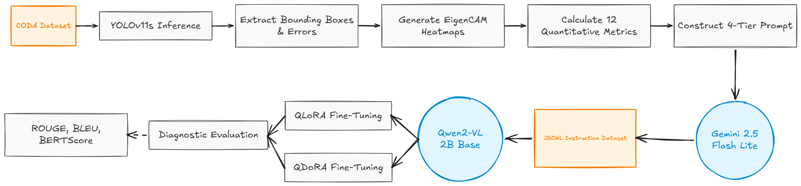

# Fine-Tuning Vision-Language Models via Gemini Distillation for Causal Diagnostics in Autonomous Driving

This documentation addresses the AI blackbox by turning confusing visual signals into clear text explanations, making it easy to understand exactly why an object detection model fails

## Main Goals

- Build a robust detection-to-explanation pipeline from YOLO outputs and XAI signals.
- Generate a high-quality instruction dataset for diagnostic reasoning in autonomous driving scenes.
- Fine-tune and compare Qwen2-VL adapters (QLoRA and QDoRA) using the same evaluation protocol.

## Workflow

## Pipeline Files

1. `yolov11s-training.ipynb`
   
   Trains the YOLO detector and produces the checkpoint for explainability analysis.

2. `xai-comparison.ipynb`
   
   Runs EigenCAM/GradCAM and produces visual diagnostic evidence from detections.

3. `regenerate_diverse_vlm_dataset.ipynb`
   
   Converts XAI evidence into diversified JSONL instruction data.

4. `finetune_qwen_vlm_lora.ipynb`
   
   Fine-tunes Qwen2-VL-2B with QLoRA and saves adapter + evaluation artifacts.

5. `finetune_qwen_vlm_dora_v2.ipynb`
   
   Fine-tunes Qwen2-VL-2B with QDoRA under the same split/evaluation setup.

6. `vlm-inference-comparison.ipynb`
   
   Compares Base vs QLoRA vs QDoRA outputs and reports ROUGE, BLEU, and BERTScore.

## References

- Google (2024) *Gemini API Documentation*
- Taori et al. (2023) *"Stanford Alpaca: An Instruction-following LLaMA model"* — Instruction-tuning data generation methodology
- Wang et al. (2023) *"Self-Instruct: Aligning LM with Self-Generated Instructions"* ([arXiv:2212.10560](https://arxiv.org/abs/2212.10560))
- Dettmers et al. (2023) "QLoRA: Efficient Finetuning of Quantized LLMs" (arXiv:2305.14314)
- Hu et al. (2022) "LoRA: Low-Rank Adaptation of Large Language Models" (arXiv:2106.09685)